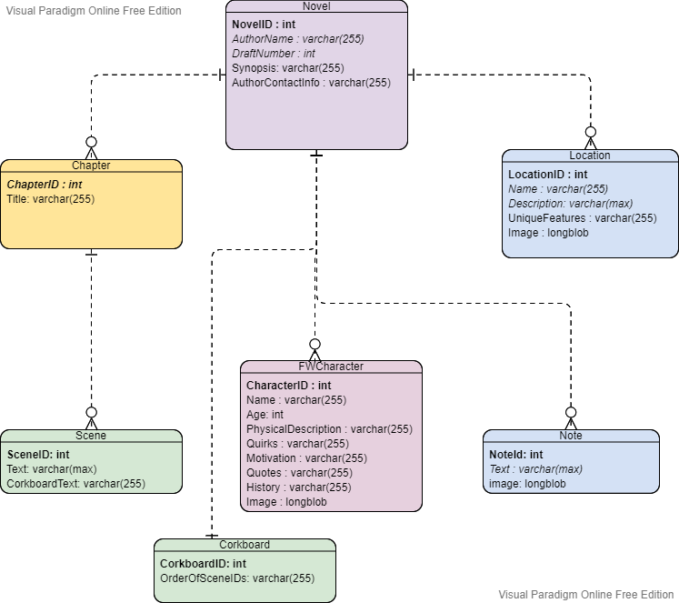

# Feather Writer
Web-based Novel Writing Software

## Documentation (RO):
https://docs.google.com/document/d/1nxLXlA9yAB5z6LwPahIjBocP20p49MnoQWEqOpRBa3c/edit?usp=sharing

## Docker Repo:
https://hub.docker.com/repository/docker/mihaialexandruteodor/featherwriter

## Diagram:


## Google Cloud Kubernetes Quickstart:

https://cloud.google.com/kubernetes-engine/docs/quickstart

## Building the Docker application with the MySQL backend:

Navigate to the location of the docker-compose.yaml file and run

```
docker-compose up
```

or

```
 docker-compose up --force-recreate --build 
```

if a rebuild is necessary. For Linux, add 'sudo' to the commands. You can also add the -d flag to run detached.

The database is exposed to port 3308, and the app to port 8081 

## Running Docker locally:

The port exposed in Dockerfile is 8081, so after you find the container image, you can build and run the container like so:
1. cd into Dockerfile folder
2. 

```
docker build . -t featherwriter
docker run -p 80:8081 featherwriter -v FeatherWriter
```

and access the image via container-ip:80

## Database container query:

1. Connect to DB via docker cli:

```
mysql -uroot -phelloworld;
```
2. Select the files DB:

```
USE files;
```
3. Show available tables:

```
SHOW TABLES;
```
