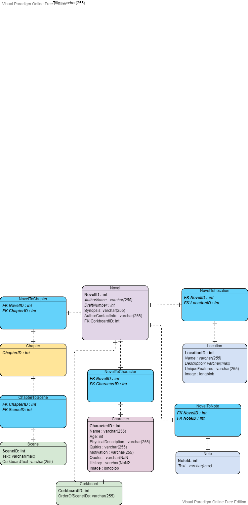

# Feather Writer
Web-based Novel Writing Software

## Documentation (RO):
https://docs.google.com/document/d/1nxLXlA9yAB5z6LwPahIjBocP20p49MnoQWEqOpRBa3c/edit?usp=sharing



## Google Cloud Kubernetes Quickstart

https://cloud.google.com/kubernetes-engine/docs/quickstart

## Running Docker locally

The port exposed in Dockerfile is 8081, so after you find the container image, you can run the container like so:

```
docker run -p 80:8081 <container-image-here>
```

and access the image via <container-ip>:80
